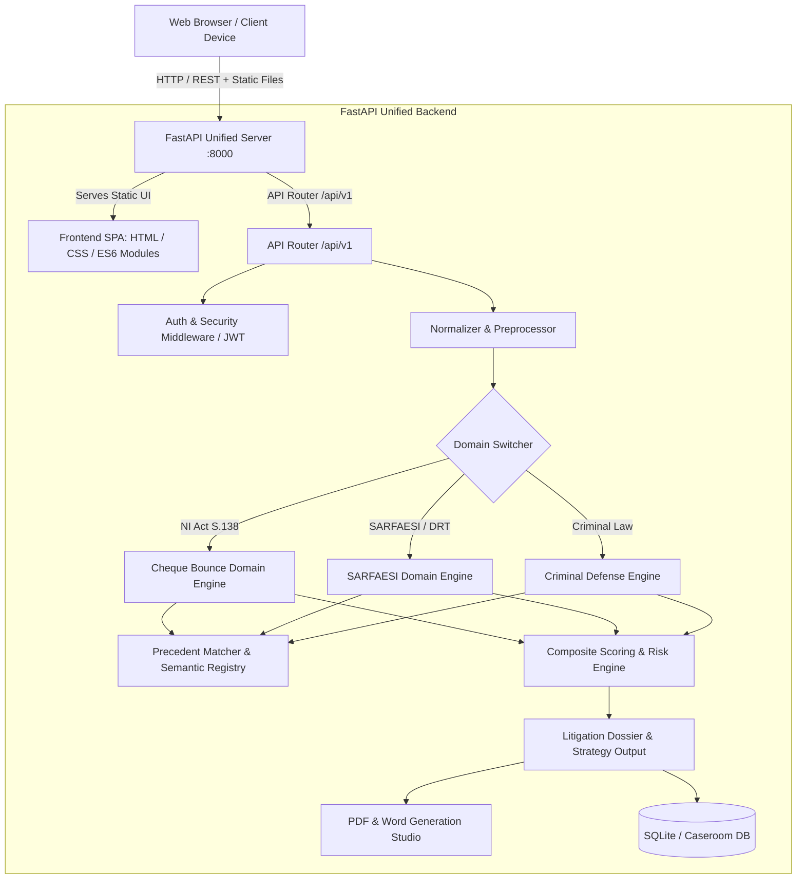
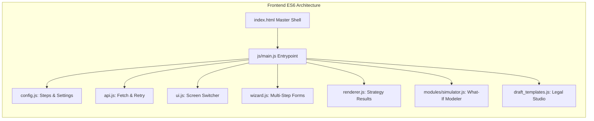
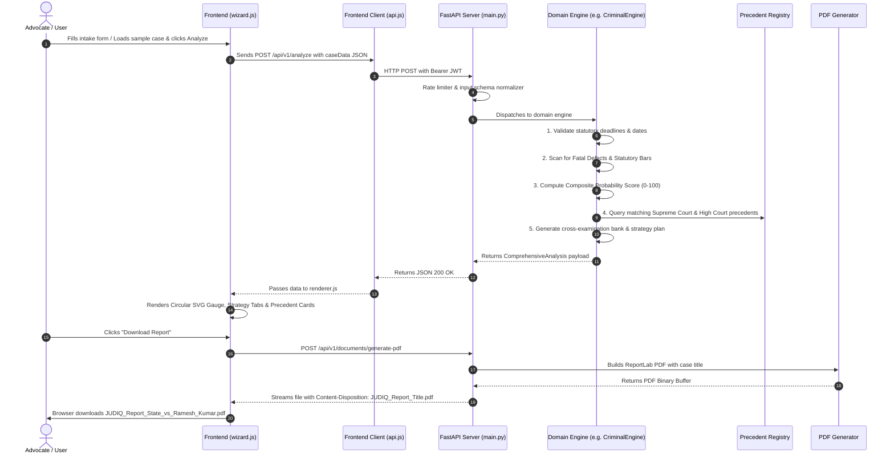

# 🏛️ JudiQ AI — Comprehensive Architecture & Engineering Guide

> **Target Audience:** Junior to Principal Engineers, Data Scientists, and Legal-Tech Developers.  
> **Repository Purpose:** Deterministic, institutional-grade Indian litigation intelligence platform covering **Negotiable Instruments Act (S.138)**, **SARFAESI & DRT**, **Criminal (IPC/CrPC & BNS/BNSS)**, and **Commercial Suits**.

---

## 📑 Table of Contents
1. [Platform Overview & Philosophy](#1-platform-overview--philosophy)
2. [High-Level System Architecture](#2-high-level-system-architecture)
3. [Repository Directory Blueprint](#3-repository-directory-blueprint)
4. [Backend Deep Dive: Core Engines & Subsystems](#4-backend-deep-dive-core-engines--subsystems)
   - [A. Base Domain Engine & Case Registry](#a-base-domain-engine--case-registry)
   - [B. Domain 1: Cheque Bounce (NI Act S.138/141/142)](#b-domain-1-cheque-bounce-ni-act-s138141142)
   - [C. Domain 2: SARFAESI & DRT Engine](#c-domain-2-sarfaesi--drt-engine)
   - [D. Domain 3: Criminal Defense & Dual-Statute Engine (IPC/CrPC ↔ BNS/BNSS)](#d-domain-3-criminal-defense--dual-statute-engine-ipccrpc--bnsbnss)
   - [E. Semantic Engine, Precedent Matching & LLM-Less Reasoning](#e-semantic-engine-precedent-matching--llm-less-reasoning)
   - [F. Document & Dossier Generation Subsystem](#f-document--dossier-generation-subsystem)
   - [G. Security, Auth, Rate Limiting & Database](#g-security-auth-rate-limiting--database)
5. [Frontend Deep Dive: Modular SPA Architecture](#5-frontend-deep-dive-modular-spa-architecture)
   - [A. Module Composition & Lifecycle](#a-module-composition--lifecycle)
   - [B. Multi-Domain Dynamic Intake Wizard](#b-multi-domain-dynamic-intake-wizard)
   - [C. Strategy Intelligence & Results Renderer](#c-strategy-intelligence--results-renderer)
   - [D. What-If Scenario Sandbox Modeler](#d-what-if-scenario-sandbox-modeler)
   - [E. Court Drafter & Document Studio](#e-court-drafter--document-studio)
   - [F. Design System & CSS Token Architecture](#f-design-system--css-token-architecture)
6. [End-to-End Data Flow Walkthrough](#6-end-to-end-data-flow-walkthrough)
7. [Junior Developer Onboarding & How-To Guides](#7-junior-developer-onboarding--how-to-guides)
   - [How to Run Locally](#how-to-run-locally)
   - [How to Run the 3,300+ Automated Tests](#how-to-run-the-3300-automated-tests)
   - [How to Add a New Statutory Rule or Fatal Defect](#how-to-add-a-new-statutory-rule-or-fatal-defect)
   - [How to Add a New Landmark Precedent](#how-to-add-a-new-landmark-precedent)
   - [How to Add a New Document Draft Template](#how-to-add-a-new-document-draft-template)

---

## 1. Platform Overview & Philosophy

JudiQ AI is designed for **courtroom-grade reliability**. In legal technology, generative hallucinations or fuzzy probabilistic logic can result in dismissal, fatal limitation bars, or wrongful incarceration.

### Core Architectural Principles:
1. **Deterministic Rule Engines First:** All critical statutory thresholds (limitation periods, notice compliance, sanction bars, mandatory pre-deposits) are executed via mathematical, zero-hallucination rule engines.
2. **Dual-Statutory Architecture:** Seamlessly operates across legacy regimes (IPC 1860, CrPC 1973, IEA 1872) and new Bharatiya laws (BNS 2023, BNSS 2023, BSA 2023).
3. **4-Point Verified Authority:** Every citation is vetted against 4 integrity pillars: *Source Authenticity*, *Textual Integrity*, *Legal Proposition*, and *Subsequent Treatment*.
4. **Single-Port Unified Deployment:** FastAPI natively serves both the JSON REST API and the responsive frontend SPA without cross-origin latency.

---

## 2. High-Level System Architecture



---

## 3. Repository Directory Blueprint

```
judiq-ai/
│
├── backend/                        # Python FastAPI Backend
│   ├── core/                       # Foundational domain abstractions
│   │   ├── base_domain_engine.py   # Abstract Base Class (ABC) for all legal engines
│   │   └── case_registry.py        # Central repository of statutory rules & precedents
│   │
│   ├── criminal/                   # Criminal Litigation Subsystem
│   │   ├── criminal_domain_engine.py # IPC/CrPC & BNS/BNSS domain coordinator
│   │   ├── criminal_rules_engine.py  # 15+ Fatal defect scanners (Sanction, 41A, 167(2), etc.)
│   │   ├── criminal_scoring_engine.py# Composite judicial probability scoring (0-100)
│   │   ├── criminal_timeline_engine.py# Arrest, remand, chargesheet, default bail milestones
│   │   ├── dual_statute_engine.py   # IPC ↔ BNS section converter & taxonomy mapper
│   │   ├── satender_antil_engine.py # Supreme Court Bail Categories (A, B, C, D)
│   │   └── criminal_knowledge_base.json # Landmark authorities (Bhajan Lal, Arnesh Kumar, etc.)
│   │
│   ├── sarfaesi/                   # SARFAESI & DRT Subsystem
│   │   ├── sarfaesi_domain_engine.py  # SARFAESI master orchestrator
│   │   ├── sarfaesi_creditor_engine.py# Secured Creditor enforcement pipeline
│   │   ├── sarfaesi_borrower_engine.py# Borrower defense & S.17 SA litigation strategy
│   │   ├── sarfaesi_rules_engine.py   # CERSAI S.26D, Agri S.31(i), IBC Moratorium scanners
│   │   ├── sarfaesi_scoring_engine.py # Recovery & challenge viability index
│   │   ├── sarfaesi_timeline_engine.py# S.13(2), 13(3A), 13(4), Rule 8/9 auction timelines
│   │   └── sarfaesi_knowledge_base.json # Mardia Chemicals, Transcore, Celir LLP precedents
│   │
│   ├── tests/                      # Pytest Benchmark Suite (3,362 Tests)
│   │   ├── test_real_world_criminal_cases.py # 60 Supreme Court real-world cases
│   │   ├── test_criminal_massive_scenarios.py# 500+ Adversarial criminal permutations
│   │   ├── test_cheque_bounce_hard_cases.py  # S.138 edge cases & limitation anomalies
│   │   ├── test_sarfaesi_ultra_hard_cases.py # Multi-lender & auction defect tests
│   │   └── ... (20+ test suites)
│   │
│   ├── api_v1.py                   # Aggregated API routes under /api/v1
│   ├── caseroom.py                 # Multi-party collaborative caseroom management
│   ├── config.py                   # Environment settings, CORS, JWT secrets
│   ├── documents.py                # PDF and Word export REST endpoints
│   ├── engine_core.py              # Base pipeline orchestrator & engine registry
│   ├── main.py                     # FastAPI entry point & unified static mount
│   ├── pdf_generator.py            # ReportLab PDF generator (Reports & Dossiers)
│   ├── word_generator.py           # MS Word (.docx) court document generator
│   └── session.py                  # SQLite database manager & migration engine
│
├── frontend/                       # Institutional Legal-Tech Frontend SPA
│   ├── js/
│   │   ├── main.js                 # Global SPA controller, auth listeners, modal handlers
│   │   └── modules/                # Specialized client modules
│   │       ├── charts.js           # Chart.js radar & score breakdown visualizers
│   │       ├── counsel_dock.js     # Persistent Co-Counsel AI assistant dock
│   │       ├── error_handler.js    # Global telemetry and unhandled error boundary
│   │       ├── modals.js           # Modal dialog managers
│   │       ├── simulator.js        # What-If interactive timeline simulator
│   │       ├── utils.js            # HTML sanitizers and cross-platform formatters
│   │       └── validation.js       # Real-time form validation & field sanitizers
│   │
│   ├── api.js                      # Centralized fetch client with JWT injection & retry
│   ├── config.js                   # Wizard step definitions, API URLs, role mappings
│   ├── draft_templates.js          # Legal draft templates (Notices, Bail, Quashing)
│   ├── index.html                  # Single-page application master markup
│   ├── renderer.js                 # Strategy results, verified authorities & gauge cards
│   ├── styles.css                  # Token design system, obsidian dark mode, glassmorphism
│   └── wizard.js                   # Dynamic multi-step case intake wizard controller
│
├── ARCHITECTURE.md                 # This Guide
└── README.md                       # Repository Overview
```

---

## 4. Backend Deep Dive: Core Engines & Subsystems

### A. Base Domain Engine & Case Registry
Located in `backend/core/base_domain_engine.py` and `case_registry.py`.
- **`BaseDomainEngine` (ABC):** Defines the standard interface that every legal domain engine must implement:
  1. `validate_inputs(case_data: dict) -> Tuple[bool, List[str]]`
  2. `evaluate_rules(case_data: dict) -> List[RuleResult]`
  3. `calculate_score(case_data: dict, rule_results: List[RuleResult]) -> ScoringResult`
  4. `match_precedents(case_data: dict, score: float) -> List[PrecedentMatch]`
  5. `generate_strategy(case_data: dict, score: float, rules: List[RuleResult]) -> StrategyPlan`
  6. `run(case_data: dict) -> ComprehensiveAnalysis`

---

### B. Domain 1: Cheque Bounce (NI Act S.138/141/142)
Files: `backend/engine.py`, `backend/scoring.py`, `backend/timeline_engine.py`, `backend/rules_engine.py`.
- **Statutory Rules Audited:**
  - **Cheque Validity:** Must be presented within 3 months of issuance date.
  - **Statutory Notice (S.138(b)):** Demand notice must be dispatched within 30 days of receiving the bank dishonour memo.
  - **15-Day Cure Window (S.138(c)):** Cause of action arises *only* after 15 days from notice delivery without payment.
  - **Limitation Period (S.142(1)(b)):** Complaint must be filed within 30 days of cause of action arising (or condonation under S.142 proviso).
  - **Vicarious Liability (S.141):** Explicit requirement to plead operational day-to-day control for company directors (*SMS Pharmaceuticals v. Neeta Bhalla*).
  - **Statutory Presumptions:** Section 118 & 139 reverse burden of proof (*Rangappa v. Sri Mohan*).

---

### C. Domain 2: SARFAESI & DRT Engine
Directory: `backend/sarfaesi/`
- **Creditor vs Borrower Dual Engine:**
  - `sarfaesi_creditor_engine.py`: Guides banks/NBFCs through strict enforcement checklists to prevent procedural quashing.
  - `sarfaesi_borrower_engine.py`: Identifies fatal bank lapses for borrowers seeking interim stay under Section 17 before the DRT.
- **Critical Statutory Checkpoints:**
  - **S.13(2) Demand Notice:** 60-day statutory notice for loan repayment.
  - **S.13(3A) Mandatory Objection Reply:** Bank *must* consider borrower representation and communicate reasons within 15 days (*Mardia Chemicals*). Failure invalidates subsequent possession.
  - **S.26D CERSAI Bar:** Enforcement is prohibited if security interest is not registered on CERSAI.
  - **S.31(i) Agricultural Land Exemption:** SARFAESI cannot be enforced on agricultural land (*K. Sreedhar v. Raus Constructions*).
  - **S.14 IBC Moratorium:** Active NCLT CIRP creates an absolute statutory stay overriding SARFAESI.
  - **Rule 8(6) & 9(1) Auction Compliance:** 30-day notice and dual newspaper publication in vernacular & English dailies (*Celir LLP v. Bafna Motors*).

---

### D. Domain 3: Criminal Defense & Dual-Statute Engine (IPC/CrPC ↔ BNS/BNSS)
Directory: `backend/criminal/`
- **Dual-Statutory Mapping (`dual_statute_engine.py`):**
  - Automatically translates offenses based on incident date (Pre-July 1, 2024 $\rightarrow$ IPC/CrPC; Post-July 1, 2024 $\rightarrow$ BNS/BNSS).
  - S.420 IPC $\leftrightarrow$ S.318 BNS (Cheating)
  - S.406/409 IPC $\leftrightarrow$ S.316 BNS (Criminal Breach of Trust)
  - S.498A IPC $\leftrightarrow$ S.85 BNS (Cruelty)
  - S.482 CrPC $\leftrightarrow$ S.528 BNSS (High Court Quashing)
- **Satender Kumar Antil (2022) Bail Categorization (`satender_antil_engine.py`):**
  - **Category A:** Offenses punishable with $\le 7$ years imprisonment. Bail without custody on summons if co-operated during investigation.
  - **Category B:** Heinous offenses (Death / Life imprisonment / $>7$ years). Strict merits examination.
  - **Category C:** Special Acts with twin negative bail conditions (NDPS S.37, PMLA S.45).
  - **Category D:** Economic offenses (deep financial fraud inquiry).
- **Default / Statutory Bail Engine (S.167(2) CrPC / S.187 BNSS):**
  - Calculates non-extendable right to default bail upon 60 or 90 days of custody if chargesheet is not filed.
- **Arnesh Kumar Compliance (S.41A CrPC / S.35 BNSS):**
  - Mandatory notice before arrest for offenses $\le 7$ years. Direct arrest without written justification constitutes a fatal procedural violation.
- **Bhajan Lal (1992) Quashing Matrix:**
  - Audits FIR allegations against the 7 landmark quashing categories (civil dispute in criminal garb, omnibus distant relative impleadment, absolute legal bar).

---

### E. Semantic Engine, Precedent Matching & LLM-Less Reasoning
Files: `backend/semantic_engine.py`, `backend/predictive_engine.py`, `backend/verification.py`.
- **Deterministic Semantic Matcher:** Matches factual matrices against curated landmark decisions using multi-factor vectorization (fact similarity, court bench authority, statutory section overlap).
- **LLM-Less Reasoning Engine:** Builds transparent, step-by-step judicial reasoning chains without invoking external APIs, guaranteeing 100% deterministic reproducibility.
- **4-Point Verified Authority Registry:** Verifies each precedent citation against:
  1. *Source Origin* (Supreme Court of India / High Court bench records).
  2. *Textual Integrity* (Exact paragraph ratio decendi).
  3. *Legal Proposition* (Binding principle).
  4. *Subsequent Treatment* (Ensures case has not been overruled by a larger bench).

---

### F. Document & Dossier Generation Subsystem
Files: `backend/documents.py`, `backend/pdf_generator.py`, `backend/word_generator.py`.
- **Dynamic Case-Aware Filenaming:**
  - Sanitizes case metadata to generate filenames formatted as `JUDIQ_{DocType}_{Complainant}_vs_{Accused}.pdf` or `JUDIQ_Report_{CaseTitle}.pdf`.
- **ReportLab PDF Engine:**
  - Generates institutional multi-page litigation dossiers with judicial seals, 2-column defense breakdown tables, circular score gauges, and verified authority annotations.
- **Word Document (.docx) Generator:**
  - Generates editable court petitions (Bail, S.482 Quashing, S.138 Legal Notice, Securitization Application) with standard court margins and signature blocks.

---

### G. Security, Auth, Rate Limiting & Database
Files: `backend/main.py`, `backend/config.py`, `backend/session.py`, `backend/limiter.py`.
- **Anonymous & Registered JWT Auth:** Supports instant anonymous session bootstrapping (`/api/v1/auth/anonymous`) as well as user accounts.
- **Rate Limiting:** Protects analysis endpoints against brute-force abuse via `slowapi` limiter.
- **Database Architecture:** Uses SQLAlchemy with SQLite for analytics and multi-room caseroom sessions.

---

## 5. Frontend Deep Dive: Modular SPA Architecture



### A. Module Composition & Lifecycle
- **Native ES6 Modules:** No Webpack/Vite bundle step required for development. The browser directly imports ES6 modules with cachebuster query strings (`?v=14`).
- **Global State Management (`window.state`):**
  - Centralized store managing `currentUser`, `userDomain`, `caseData`, `analysisResult`, and `currentStep`.
- **Screen Router (`ui.switchScreen`):**
  - Seamlessly toggles visibility between screens (`landingScreen`, `dashboardScreen`, `caseWizardScreen`, `resultsScreen`, `draftScreen`).

---

### B. Multi-Domain Dynamic Intake Wizard
File: `frontend/wizard.js` & `frontend/config.js`
- Dynamically generates form inputs based on the selected legal domain:
  - `wizardSteps` $\rightarrow$ Cheque Bounce (S.138)
  - `sarfaesiWizardSteps` $\rightarrow$ SARFAESI & DRT
  - `criminalWizardSteps` $\rightarrow$ Criminal (IPC/CrPC & BNS/BNSS)
  - `civilWizardSteps` $\rightarrow$ Commercial Suits
- Features real-time autosave to `localStorage` and a 1-click **"⚡ Load Sample Case"** preset.

---

### C. Strategy Intelligence & Results Renderer
File: `frontend/renderer.js`
- **Dynamic Circular Score Gauge:** Animated SVG score dial (0–100) color-coded by win probability (Green $>75$, Amber $50-74$, Red $<50$).
- **Verified Authority Cards:** Rich cards displaying 4-point verification checkmarks, paragraph citations, and court bench details.
- **Criminal Taxonomy Badges:** Displays Satender Kumar Antil category badges, S.167(2) default bail alerts, and trial cross-examination question banks with 1-click clipboard copy.

---

### D. What-If Scenario Sandbox Modeler
File: `frontend/js/modules/simulator.js` & `frontend/index.html`
- Interactive sandbox allowing lawyers to simulate factual modifications in real-time (e.g. *"What if notice was sent 5 days earlier?"* or *"What if S.65B certificate is excluded?"*).
- Instantly recalculates win probability score and updates strategy tabs without re-submitting the full case.

---

### E. Court Drafter & Document Studio
Files: `frontend/draft_templates.js` & `frontend/js/main.js`
- Dual-pane drafting workbench with live template customization:
  - S.138 Statutory Demand Notice
  - S.438 Anticipatory Bail Petition
  - S.482 CrPC / S.528 BNSS Quashing Petition
  - S.17 SARFAESI Securitization Application (DRT)
- Dynamic tone switchers: **Standard Courtroom**, **Aggressive / Urgent**, **Conciliatory / Pre-Trial**.
- One-click export to **Court-Formatted PDF**, **Editable Word (.doc)**, and **Plain Text (.txt)**.

---

### F. Design System & CSS Token Architecture
File: `frontend/styles.css`
- **Obsidian Velvet Dark Palette:**
  - `--bg-base`: `#070b14` (Deep obsidian)
  - `--bg-surface`: `#0e1424` (Card background)
  - `--bg-elevated`: `#141c30` (Modal / Elevated component)
- **Judicial Gold Accents:**
  - `--gold-300` to `--gold-700`, `--gold-glow` (Used for Supreme Court badges, statutory seals).
- **Electric Indigo & Sapphire:**
  - Primary interactive accents and focus glow outlines.
- **Glassmorphism & Radial Mesh:**
  - Multi-layer backdrop blur (`20px`), subtle border translucency (`rgba(255,255,255,0.08)`), and top radial atmospheric lighting.

---

## 6. End-to-End Data Flow Walkthrough



---

## 7. Junior Developer Onboarding & How-To Guides

### How to Run Locally
1. **Clone the repository:**
   ```bash
   git clone https://bitbucket.org/judiqai/judiq.git
   cd judiq-ai
   ```
2. **Install Python dependencies:**
   ```bash
   pip install -r backend/requirements.txt
   ```
3. **Start the Unified Server:**
   ```bash
   cd backend
   python -m uvicorn main:app --host 127.0.0.1 --port 8000 --reload
   ```
4. **Open in browser:**
   Navigate to [**http://localhost:8000/**](http://localhost:8000/).

---

### How to Run the 3,300+ Automated Tests
We maintain 100% test pass rates across all 3,362 test cases:
```bash
# Run all tests
python -m pytest backend/tests

# Run specific domain test suite
python -m pytest backend/tests/test_real_world_criminal_cases.py -v
python -m pytest backend/tests/test_sarfaesi_ultra_hard_cases.py -v
python -m pytest backend/tests/test_cheque_bounce_hard_cases.py -v
```

---

### How to Add a New Statutory Rule or Fatal Defect
1. Open the corresponding domain rules engine (e.g. `backend/criminal/criminal_rules_engine.py` or `backend/sarfaesi/sarfaesi_rules_engine.py`).
2. Add your rule logic to the `evaluate_rules` method:
   ```python
   # Example: Adding a new statutory bar
   if case_data.get("unauthorized_investigating_officer") is True:
       fatal_defects.append({
           "code": "CRIM-FATAL-IO-01",
           "title": "Investigation by Incompetent Officer",
           "severity": "FATAL",
           "description": "Investigation conducted by an officer below the rank of DSP without statutory authorization.",
           "statutory_ref": "Section 17 Prevention of Corruption Act",
           "remedy": "File Section 482 CrPC / S.528 BNSS Quashing Petition"
       })
   ```
3. Add a test case in `backend/tests/` to verify that this fatal defect triggers correctly.

---

### How to Add a New Landmark Precedent
1. Open the relevant domain knowledge base JSON (e.g. `backend/criminal/criminal_knowledge_base.json` or `backend/sarfaesi/sarfaesi_knowledge_base.json`).
2. Add a new precedent object with the 4-point verification structure:
   ```json
   {
     "citation": "2026 INSC 142",
     "case_name": "State vs Exemplar",
     "court": "Supreme Court of India",
     "year": 2026,
     "ratio": "Mere commercial breach without fraudulent inception cannot sustain cheating charges.",
     "sections": ["S.420 IPC", "S.318 BNS"],
     "favorable_to": "accused",
     "verification": {
       "source_verified": true,
       "textual_integrity": true,
       "proposition_binding": true,
       "subsequent_treatment": "Good Law (Affirmed by 3-Judge Bench)"
     }
   }
   ```

---

### How to Add a New Document Draft Template
1. Open `frontend/draft_templates.js`.
2. Add a new template object into the `DRAFT_TYPES` array:
   ```javascript
   {
       id: 'my_new_template',
       name: 'Custom Application Template',
       category: 'Criminal',
       generate: (data) => `IN THE COURT OF ${data.court_location}\n\nBETWEEN:\n${data.complainant_name} ... Complainant\nVERSUS\n${data.accused_name} ... Accused\n\n...`
   }
   ```
3. The template will automatically appear in the Court Document Studio template selector dropdown.

---

### 🛡️ Code Style & Pull Request Guidelines
- **Zero Hallucination:** Never introduce probabilistic or guess-work outputs for date calculations or limitation bars.
- **Backwards Compatibility:** Always maintain support for both IPC and BNS regimes.
- **Strict Testing:** PRs must maintain 100% pass rate on `python -m pytest backend/tests`.
