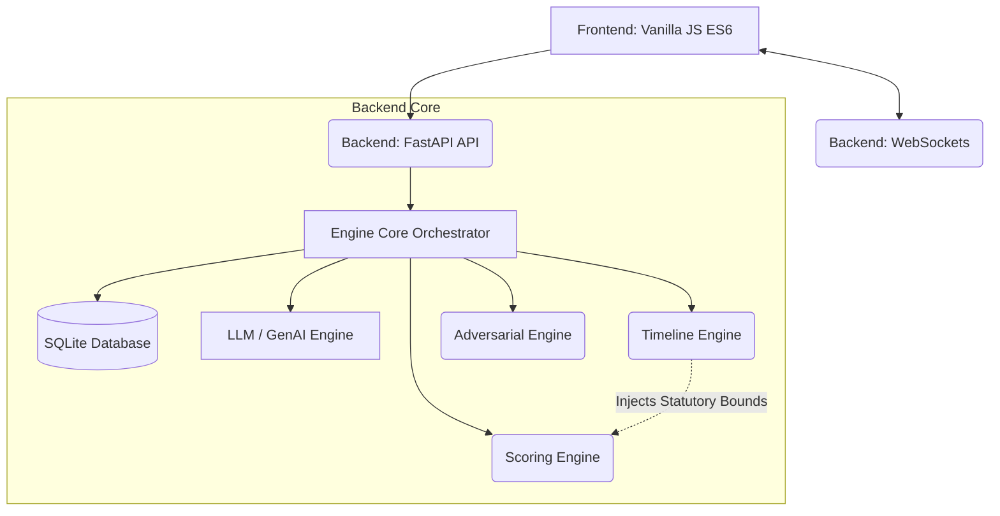

# JudiQ AI: The Litigation Operating System v12.0


**Win the Courtroom Before You Step In.**

JudiQ AI is an advanced legal intelligence platform engineered for Indian legal practitioners, law firms, and institutional legal departments. Specializing in **Section 138 NI Act (Cheque Bounce)** and foundational criminal litigation, JudiQ transforms raw case data into courtroom-ready strategy, forensic audits, and high-fidelity legal drafts.

---

## 🏛️ System Architecture

JudiQ features a strict decoupling between presentation logic and backend analytical layers, ensuring security, maintainability, and deterministic rules execution.



### Key Architectural Tenets
* **Decoupled Engines**: The Backend features strictly segregated responsibilities. The `TimelineEngine` identifies structural bounds (e.g., limitation period issues), and explicitly passes these objects into the `ScoringEngine` so the scoring engine calculates risk accurately without duplicating logic. Fatal defects apply multiplicative penalties rather than raw zeros.
* **ES6 Modular Frontend**: The frontend uses a clean ES6 `import/export` structure originating from `js/main.js`. There are no IIFEs or global `window.` state pollutions.
* **Resiliency**: The UI implements gracefully degraded fallbacks (e.g., offline queues, WebSocket exponential backoff, image fallbacks) and the backend implements global `try/except` bounds (`_safe_call`) to ensure the orchestrator never halts.

---

## 2. Frontend Overview
**Path:** `/frontend`

The frontend is a lightweight, high-performance vanilla JS application. It leverages `Chart.js` for data visualization and a custom state management utility.

### Running the Frontend
Because strict ES6 modules use CORS protocols natively, you cannot launch `index.html` via `file://`. You must serve it over an HTTP server.

**Windows PowerShell:**
```powershell
cd frontend
.\start.ps1
```
*(Or simply run `python -m http.server 8080` in the frontend directory)*

Access the app at `http://localhost:8080`.

### Directory Structure
- `index.html`: The main structural layout (UI).
- `styles.css`: The central stylesheet containing dynamic theme variables (Dark/Light).
- `js/main.js`: The application entry point. Coordinates module imports.
- `js/modules/`: Individual isolated business-logic files:
  - `state.js`: Global singleton data store.
  - `config.js`: Runtime URL/Environment configurations.
  - `caseroom.js`: WebSocket logic and task syncs.
  - `charts.js`: `ChartRegistry` that prevents memory leaks during re-renders.
  - `wizard.js`: Form management and debounced API interactions.
  - `error_handler.js` & `ui.js`: DOM updates, sanitization (DOMPurify), and telemetry.

---

## 3. Backend Overview
**Path:** `/backend`

A robust FastAPI backend powering the deep legal analytics, case storage, and AI interactions.

### Running the Backend

**Prerequisites:** Python 3.10+

```powershell
cd backend
python -m venv venv
.\venv\Scripts\activate
pip install -r requirements.txt

# Run the API
python api.py
```
*(Or run `uvicorn main:app --reload`)*

Access the Swagger UI at `http://localhost:8000/docs`.

### Key Backend Modules
- `engine_core.py`: The central orchestrator routing requests through analysis engines.
- `api_v1.py` & `main.py`: FastAPI routing, Rate limiting (5/minute), and Telemetry.
- `scoring_engine.py`: Uses a multi-pillar approach (e.g., S.138 Cheque Bounce: Cheque, Notice, Memo, Timelines). 
- `timeline_engine.py`: Maps complex legal timelines to identify statutory limitation breaches.
- `caseroom_logic.py` & `caseroom.py`: Real-time bidirectional socket logic and secure document upload (AES-256 Fernet Encryption).
- `schemas.py`: Pydantic V2 validations for all inbound REST payloads, featuring recursive HTML/XSS sanitization.
- `tests/`: Comprehensive deterministic integration and unit test suite relying on Pytest mocking (LLM bypassed).

---

## 4. Testing & Quality Assurance
The codebase uses a robust testing paradigm to prevent regressions, particularly relying on deterministic structures rather than brittle string-matching.

### Backend Tests
From the `backend` directory, run:
```powershell
pytest tests/
```
The test suite explicitly disables LLM inference via `monkeypatch` to ensure the core rules engine acts deterministically in CI environments.

---

## 5. Security Posture
- **Input Sanitization**: Both Frontend (DOMPurify via `textContent`/`setHTML`) and Backend (`Pydantic` recursive `sanitize_html`) strip XSS payload injections.
- **DDoS / Rate Limiting**: `slowapi` enforces strict throughput caps (`5/minute` for heavy AI endpoints).
- **Graceful Error Handling**: Client-side unhandled promise rejections post to a `telemetry` API rather than crashing the interface. Backend crashes yield safe `500` JSON shapes without dumping tracebacks to clients.
- **End-to-End Encryption**: Physical evidence and documents uploaded to the Caseroom are encrypted using AES-256 Fernet before being written to disk.

---

## ⚖️ Legal Disclaimer

JudiQ AI is a legal intelligence tool designed to assist qualified legal professionals. It does **not** provide legal advice. All outputs and drafts must be reviewed, verified, and signed by a licensed advocate before being filed in any court of law.

---

© 2026 JudiQ AI. Built for the Institutional Courtroom.
