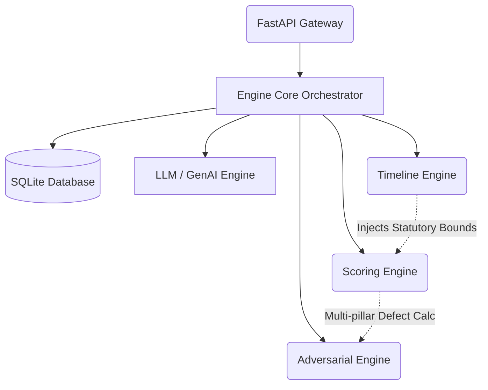

# JudiQ AI: Backend


The **JudiQ AI Backend** powers deep legal analytics, deterministic statutory calculations, and generative AI drafting for the JudiQ Litigation Operating System. Engineered specifically for **Section 138 NI Act** (Cheque Bounce) matters, it operates under strict segregation of duties to ensure predictable courtroom intelligence.

---

## 🏛️ System Architecture

The backend strictly decouples analytical engines to avoid hallucinations and ensure that statutory bounds directly inform the final analysis:



### Core Engines
- **Timeline Engine (`timeline_engine.py`)**: Maps legal timelines to identify statutory limitation breaches.
- **Scoring Engine (`scoring_engine.py`)**: Multi-pillar approach calculates structural risk. Fatal defects apply multiplicative penalties.
- **Adversarial Engine (`adversarial_engine.py`)**: Simulates opposing counsel arguments to build defense resilience.
- **Draft Engine (`draft_engine.py`)**: Generates high-fidelity legal drafts and court-ready pleadings based on AI synthesis.

---

## 🚀 Setup & Running Locally

**Prerequisites:** Python 3.10+

### Windows PowerShell:
```powershell
# Create Virtual Environment
python -m venv venv
.\venv\Scripts\activate

# Install dependencies
pip install -r requirements.txt

# Run the API Server
python main.py
```
*(Alternatively, run `uvicorn main:app --reload`)*

Access the interactive Swagger documentation at `http://localhost:8000/docs`.

---

## 🔒 Security Posture
- **End-to-End Encryption**: Physical evidence is encrypted using AES-256 Fernet before being written to disk in the Caseroom logic.
- **Input Sanitization**: Pydantic V2 schemas implement recursive HTML/XSS sanitization for all inbound REST payloads.
- **DDoS Protection**: `slowapi` enforces strict throughput caps on AI generation endpoints (e.g., 5 requests/minute).

---

## 🧪 Testing

The codebase uses deterministic testing to prevent regressions.

```powershell
pytest tests/
```
*Note: The test suite explicitly disables LLM inference via `monkeypatch` to ensure the core rules engines act deterministically in CI environments.*

---

© 2026 JudiQ AI. Built for the Institutional Courtroom.
