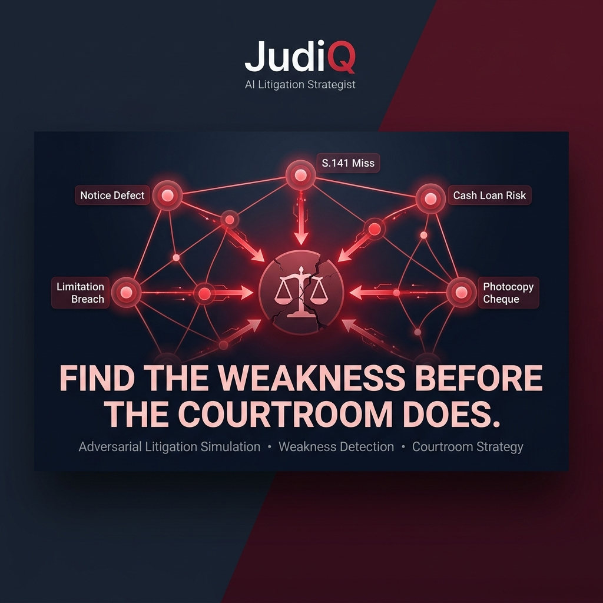
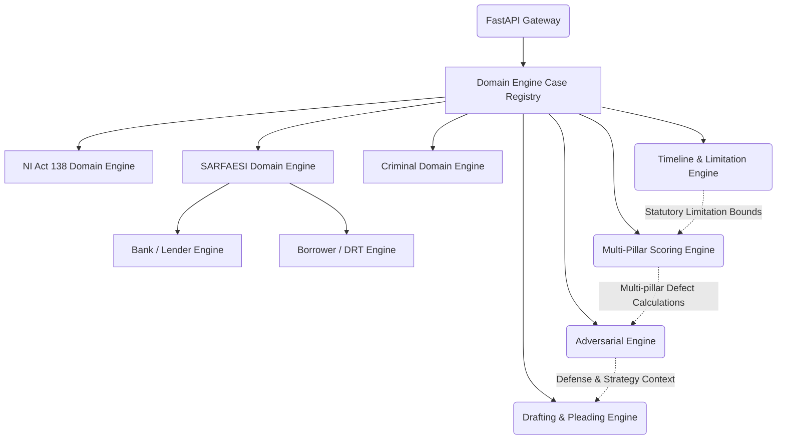

# JudiQ AI: Backend




The **JudiQ AI Backend** powers deep litigation analytics, deterministic statutory calculations, and generative AI pleading generation for the JudiQ Litigation Operating System. Built for high-stakes Indian litigation (**Section 138 NI Act** and **SARFAESI Act 2002** matters), it operates under strict segregation of duties to deliver predictable, court-verifiable legal intelligence.

---

## 🏛️ System Architecture & Domain Engines

The backend utilizes a pluggable domain architecture (`core/`) that decouples analytical engines to eliminate LLM hallucination and ensure statutory bounds govern all score outputs:



### Core Architecture Components
- **Domain Registry (`core/case_registry.py`)**: Factory pattern managing domain-specific litigation engines.
- **SARFAESI Domain Suite (`sarfaesi/`)**: Specialized analysis for Section 13(2) Demand Notices, Section 13(4) Possession Notices, Section 14 DM/CMM Applications, and Section 17 DRT Appeals.
- **Timeline Engine (`sarfaesi_timeline_engine.py` / `timeline_engine.py`)**: Validates mandatory statutory windows (e.g. 60-day notice periods, 45-day DRT filing limitations).
- **Scoring Engine (`sarfaesi_scoring_engine.py` / `scoring_engine.py`)**: Calculates quantitative litigation health scores, applying multiplicative penalties for fatal procedural defects.
- **Adversarial Engine (`sarfaesi_adversarial_engine.py` / `adversarial_engine.py`)**: Simulates opposing counsel arguments to expose vulnerability vectors and build defensive counter-strategies.
- **Draft Engine (`draft_engine.py`)**: Generates court-ready legal drafts, notices, and pleadings.
- **Audit & Citation Subsystems (`audit/`, `citation/`)**: Cryptographic audit ledger logging and statutory/precedent citation verification.

---

## 🚀 Setup & Local Execution

**Prerequisites:** Python 3.11+

### Windows PowerShell:
```powershell
# Navigate to backend directory
cd backend

# Create Virtual Environment
python -m venv venv
.\venv\Scripts\activate

# Install dependencies
pip install -r requirements.txt

# Run the API Server
python main.py
```
*(Alternatively, run `uvicorn main:app --reload`)*

Access the interactive Swagger documentation at `http://localhost:8000/docs`.

---

## ☁️ Cloud Deployment (Render / Docker)

The backend is configured for deployment on Render or Docker:
- **Build Command**: `pip install -r requirements.txt`
- **Start Command**: `gunicorn -w 1 -k uvicorn.workers.UvicornWorker main:app --bind 0.0.0.0:$PORT`
- **Configuration**: Pinned to Python 3.11 (`render.yaml`) with complete authentication (`passlib`, `PyJWT`) and CORS middleware.

---

## 🔒 Security & Data Integrity
- **End-to-End Encryption**: Physical evidence is encrypted using AES-256 Fernet in the Caseroom storage module.
- **Input Sanitization**: Pydantic V2 schemas enforce recursive HTML/XSS sanitization on inbound REST payloads.
- **DDoS & Rate Limiting**: `slowapi` enforces throughput caps on AI generation and analysis endpoints.
- **Audit Ledger**: Cryptographic hash logging (`audit/audit_ledger.py`) ensures non-repudiable audit trails.

---

## 🧪 Testing & Validation Benchmark

The codebase includes an extensive suite of deterministic unit tests and 25-case benchmark datasets:

```powershell
# Run full test suite
pytest tests/

# Key Test Modules
pytest tests/test_sarfaesi_engine.py
pytest tests/test_institutional_architecture.py
pytest tests/test_benchmark_v2_adversarial.py
```
*Note: Test runs mock external LLM calls to ensure deterministic execution in CI environments.*

---

© 2026 JudiQ AI. Built for the Institutional Courtroom.
